# Online Boutique with Multi-Cloud Kubernetes Clusters

## Table of Contents
- [File structure](#file-structure)
- [Set up EKS cluster with terraform](#set-up-eks-cluster-with-terraform)
- [Set up LKE cluster](#set-up-lke-cluster)
- [Set up GKE cluster](#set-up-gke-cluster)
- [What I change from the original code](#what-i-change-from-the-original-code)
- [Credit](#credit)


## File structure
- kubernetes : contains yaml files for deploying consul and microservice in both eks and lke cluster
- terraform : contains terraform code for provisioning eks cluster in AWS
- screenshots : contains screenshots for each step of the demo
- kubenetes-manifests : contains yaml files for deploying microservice in gke cluster

## Set up EKS cluster with terraform

prerequisite : create account AWS [https://signin.aws.amazon.com/signup?request_type=register]

### How to get access key and secret key in AWS
1. Go to AWS console
IAM --> USER --> create user

2. - Step 1 Enter username
   - Step 2 Permission option: choose attach policies directly --> select Administrator access
   - Step 3 Create user
   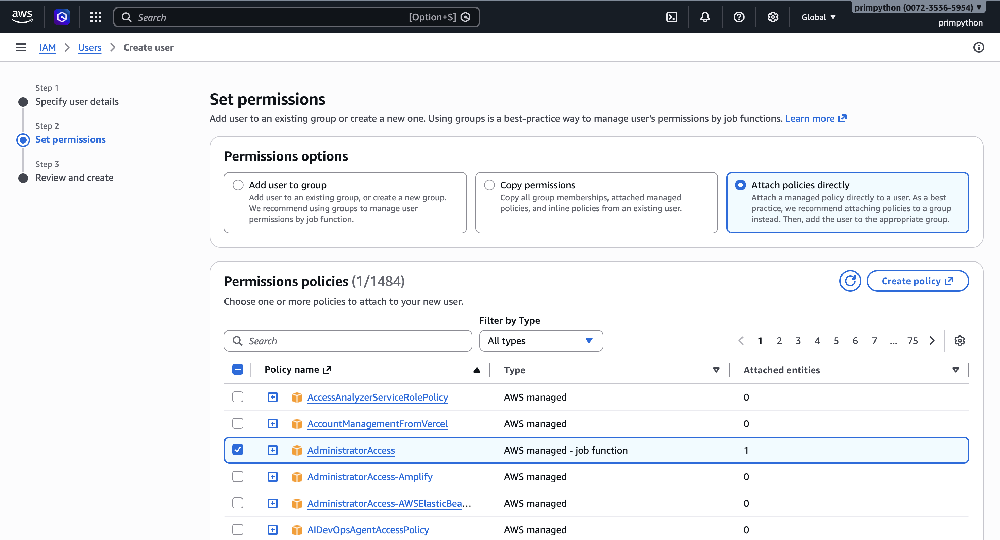

3. Once create user successfully, go to that user
   3.1 choose security credentials tab
   3.2 create access key : 
      - Step 1 Choose command line interface use case
      - Step 2 Option (do nothing)
      - Step 3 Retrieve access key and secret key and save it in a safe place because you won't be able to see the secret key again after this step

   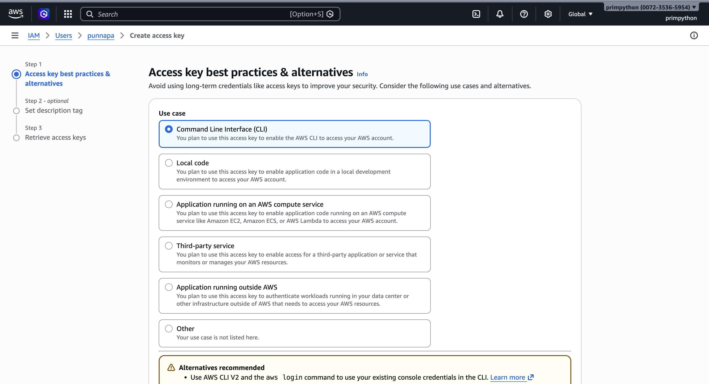

4. Copy the access key and secret key and put inside terraform.tfvars
```bash
cd terraform
cat <<EOF > terraform.tfvars
aws_access_key_id="your-access-key"
aws_secret_access_key="your-secret-key"
EOF
```

5. Run terraform commands
```sh
terraform init
terraform plan
terraform apply -var-file terraform.tfvars
```

6. Update kubeconfig file for cluster in ~/.kube
```sh
aws eks update-kubeconfig --region eu-central-1 --name myapp-eks-cluster
```

7. Deploy consul
```sh
helm repo add hashicorp https://helm.releases.hashicorp.com
helm install eks hashicorp/consul --version 1.0.0 --values consul-values.yaml --set global.datacenter=eks
```

8. Check pod
```sh
kubectl get pod
```
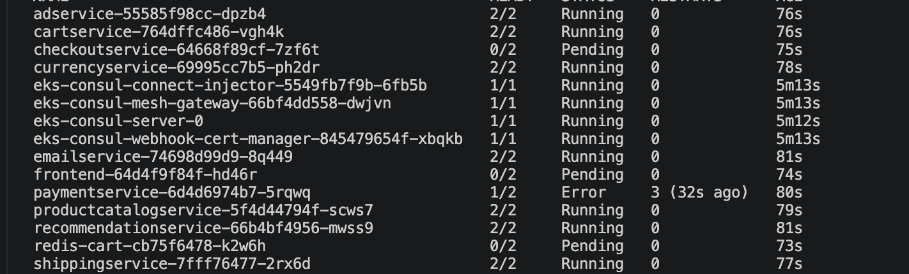

9. Update kubeconfig file for cluster in ~/.kube
```sh
aws eks update-kubeconfig --region eu-central-1 --name myapp-eks-cluster
```

10. Deploy microservice
```sh
kubectl apply -f config-consul.yaml
```

11. Check service
```sh
kubectl get svc
```
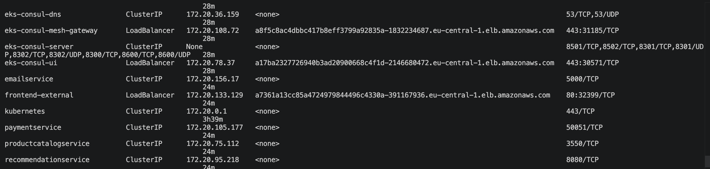

12. Go to Consul UI by using EXTERNAL-IP of consul-ui service
```sh
https://EXTERNAL-IP
```
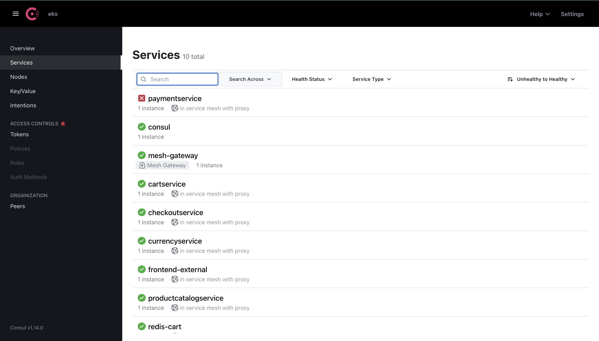

13. Access the web frontend in a browser using the frontend's external IP.
```sh
EXTERNAL-IP:80
```
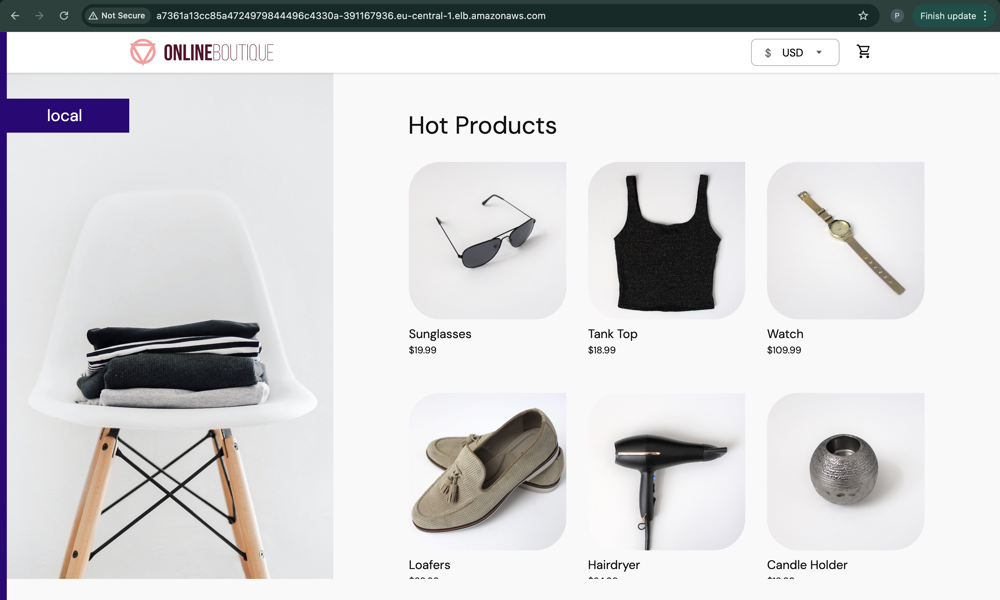

14. Configure access rules in Consul UI about paymentservice
Go to intentions tab in Consul UI, create 3 intentions with 
   - source = checkoutservice, destination = paymentservice, action = allow
   - source = *, destination = paymentservice, action = deny
   - source = paymentservice, destination = *, action = deny

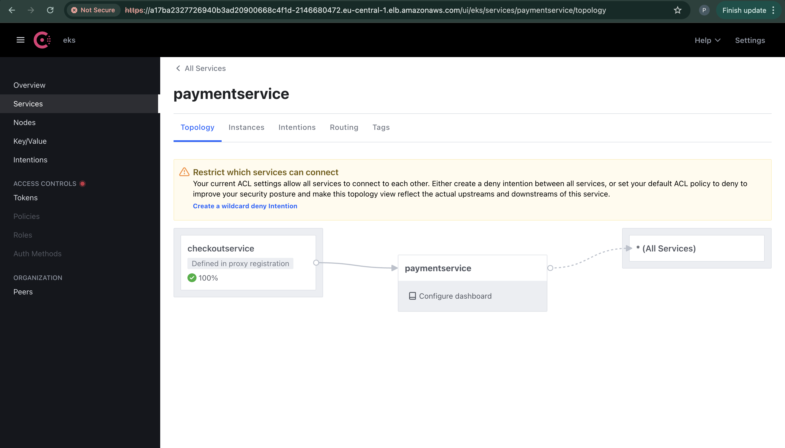

## Set up LKE cluster
Prerequisite: create account in Linode [https://www.linode.com/]

1. create the cluster in Linode called 'lke' and download lke-consul-kubeconfig.yaml (my lke-consul-kubeconfig.yaml in kubenetes folder)
```bash
cd kubernetes
export KUBECONFIG=~/Downloads/lke-consul-kubeconfig.yaml # or your path file
```
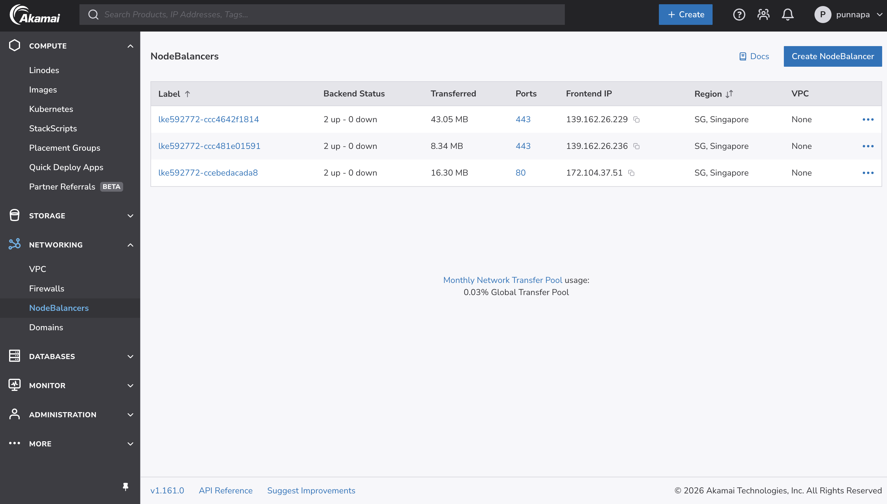

2. Check node
```bash
kubectl get node
```

3. Set permissions
```bash
chmod 700 ~/Downloads/lke-consul-kubeconfig.yaml
```

4. Deploy consul
```bash
helm repo add hashicorp https://helm.releases.hashicorp.com
helm install lke hashicorp/consul --version 1.0.0 --values consul-values.yaml --set global.datacenter=lke
```

5. Check crd
```bash
kubectl get crd | grep consul
```

6. Deploy microservice
```bash
kubectl apply -f config-consul.yaml
```

7. Check service
```bash
kubectl get svc
```
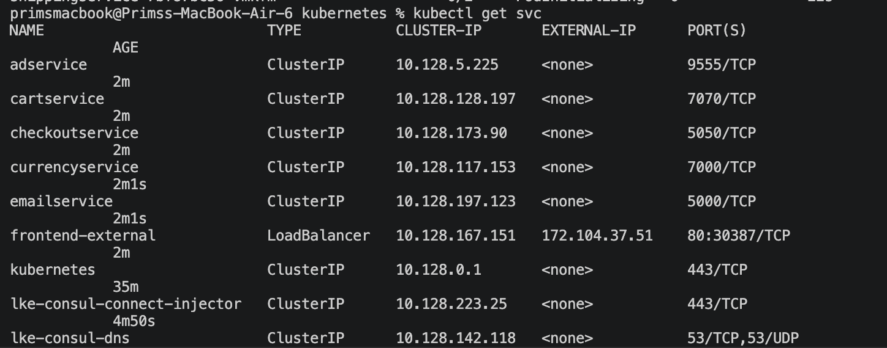

8. Go to Consul UI by using EXTERNAL-IP of consul-ui service
```sh
https://EXTERNAL-IP
```
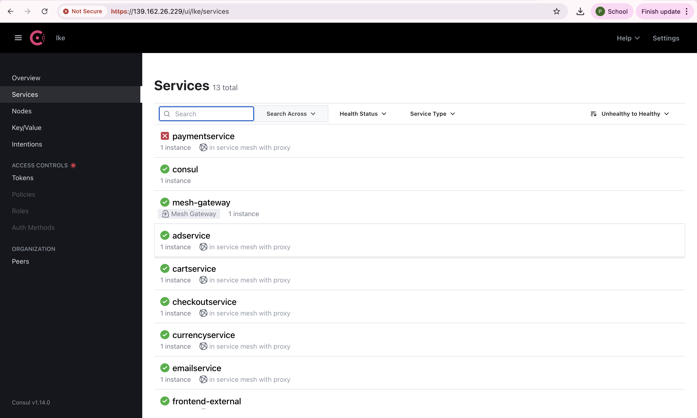

9. Access the web frontend in a browser using the frontend's external IP.
```sh
EXTERNAL-IP:80
```
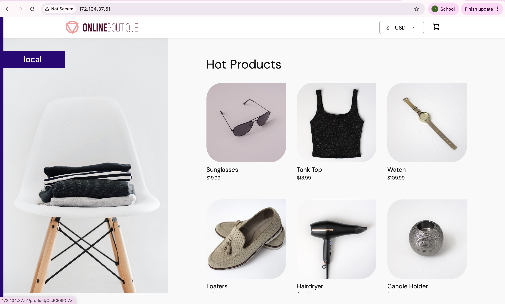


## Connecting to EKS cluster and LKE cluster
1. In lke terminal, 
```bash
kubectl config current-context # make sure you are in lke cluster
kubectl apply -f consul-mesh-gateway.yaml
kubectl get mesh # check if mesh gateway is created
```

2. In eks terminal, 
```bash
kubectl config current-context # make sure you are in eks cluster
kubectl apply -f consul-mesh-gateway.yaml
kubectl get mesh # check if mesh gateway is created
```

3. Go to eks consul UI and choose peer tab, 
   1. Add peer connection with lke cluster : generate token tab (name of peer = lke) and generate token
   2. Copy token and close
   3. Go to lke consul UI, choose peer tab, add peer connection with eks cluster : establish connection tab, paste the token and establish connection

#### LKE peer connection with EKS cluster
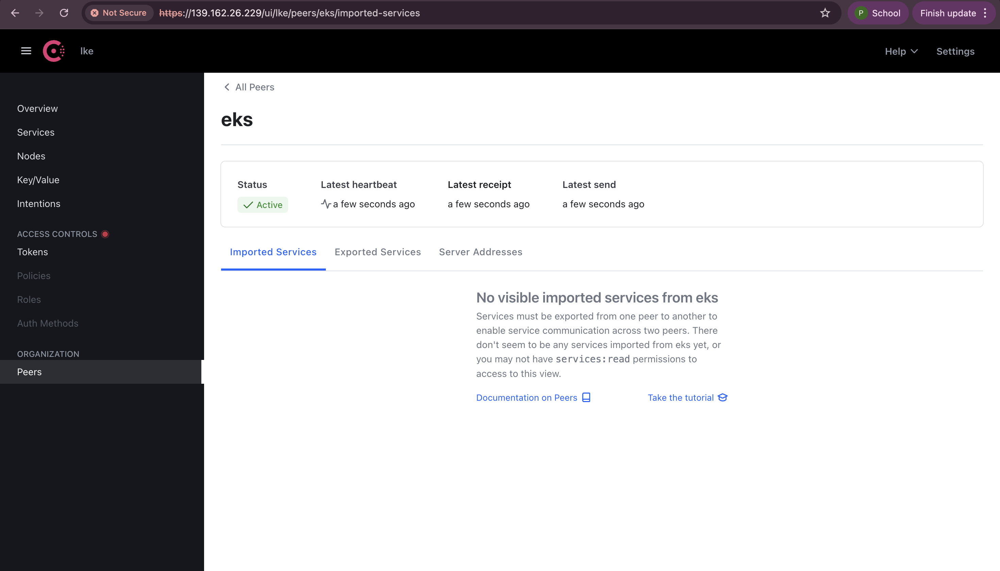
#### EKS peer connection with LKE cluster
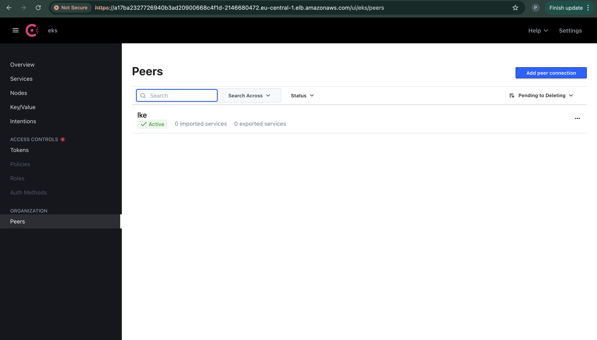

## Configure failover with service resolver
1. Export service in lke cluster
```bash
# in lke terminal
kubectl apply -f exported-service.yaml
```
2. Go to lke consul UI, check peer tap, click exported service. make sure you see shippingservice
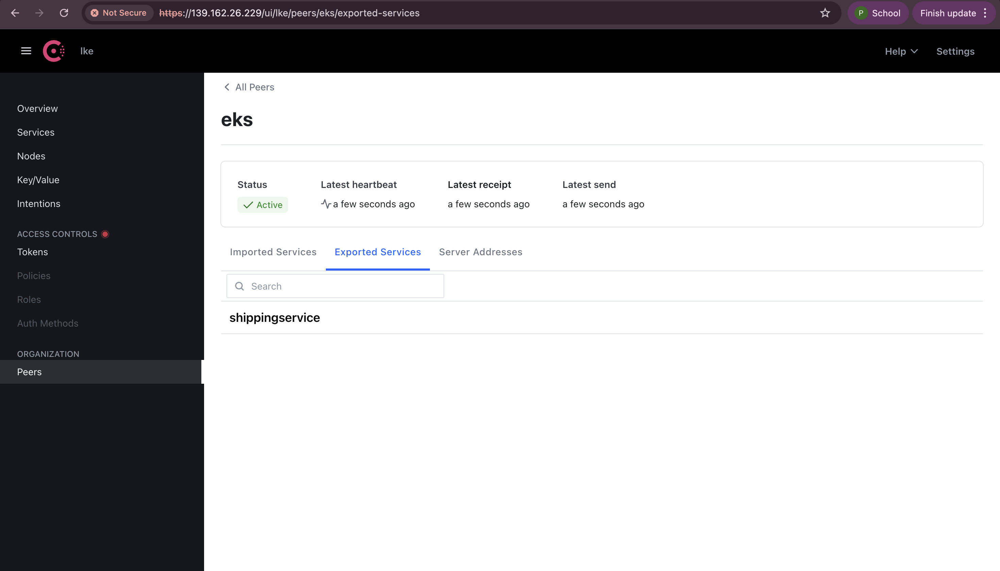

3. Go to eks consul UI, check service tab, see shippingservice
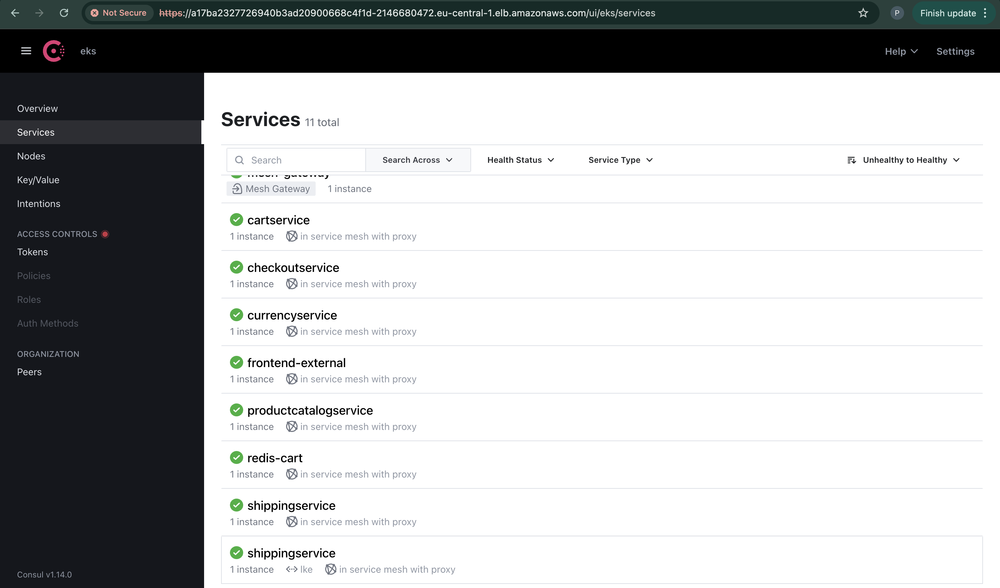

4. Apply service resolver in eks cluster
```bash
# in eks terminal
kubectl apply -f service-resolver.yaml
```
5. Try to delete shippingservice in eks cluster
```bash
kubectl delete deployment shippingservice
```
6. Go to web frontend, try to add some items to the cart, see if shippingservice is still working or not.
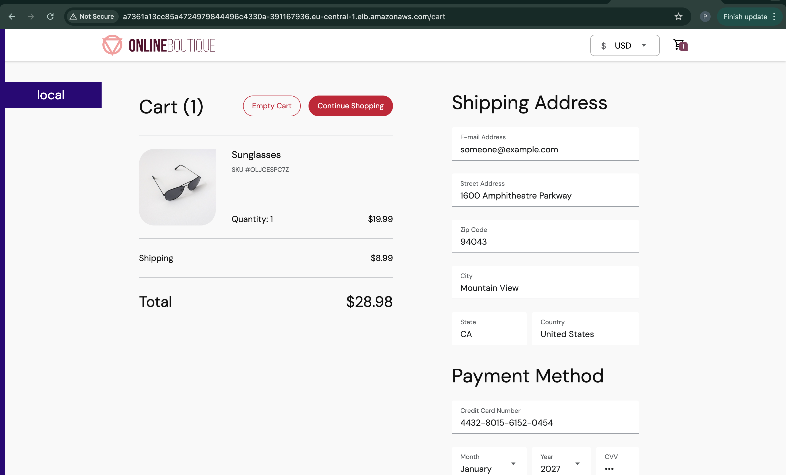


## Set up GKE cluster

### Prerequisites
   - [Google Cloud project](https://cloud.google.com/resource-manager/docs/creating-managing-projects#creating_a_project).
   - Shell environment with `gcloud`, `git`, and `kubectl`.
   - When create project, make sure to enable billing and set up a billing account. You can follow [this guide](https://cloud.google.com/billing/docs/how-to/manage-billing-account) to set up a billing account and link it to your project.
   - Ensure the Google Kubernetes Engine API is enabled. You can do this by going to the [Google Cloud Console](https://console.cloud.google.com/apis/library/container.googleapis.com) and enabling the Kubernetes Engine API for your project.

## Deploy Online Boutique on GKE
1. Go to kubernetes-manifests folder
   ```sh
   cd kubernetes-manifests
   ```

2. Set the Google Cloud project and region and ensure the Google Kubernetes Engine API is enabled.

   ```sh
   export PROJECT_ID=<PROJECT_ID>
   export REGION=us-central1
   gcloud services enable container.googleapis.com \
     --project=${PROJECT_ID}
   ```

   Substitute `<PROJECT_ID>` with the ID of your Google Cloud project.

3. Create a GKE cluster and get the credentials for it.

   ```sh
   gcloud container clusters create-auto online-boutique \
     --project=${PROJECT_ID} --region=${REGION}
   ```

   Creating the cluster may take a few minutes.

4. Install Consul Service Mesh on GKE. Add the HashiCorp Helm repository and install Consul.
   ```bash
   helm repo add hashicorp https://helm.releases.hashicorp.com
   helm install gke hashicorp/consul --version 1.0.0  --values consul-values.yaml # if you already have consul installed, use `helm upgrade gke hashicorp/consul --values consul-values.yaml`
   ```
Check the summary of the resources created by the Helm:
   ```bash
   kubectl get all
   ```
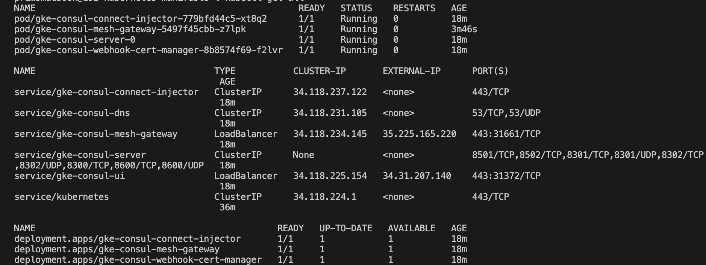

Verify the CRDs are installed:
   ```bash
   kubectl get crd | grep consul
   ```
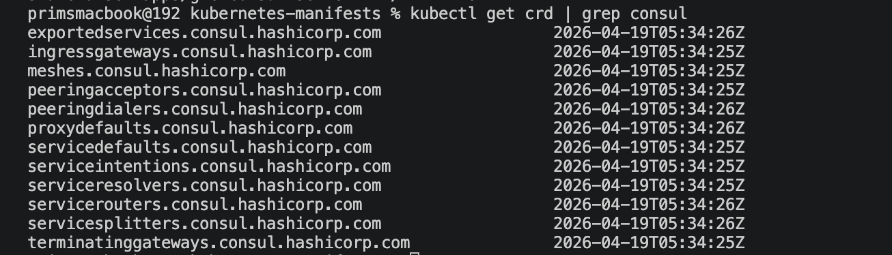

5. Deploy Online Boutique to the cluster.

   ```bash
   kubectl apply -f config-consul.yaml
   ```

6. Wait for the pods to be ready.

   ```bash
   kubectl get pod
   ```

After a few minutes, you should see the Pods in a `Running` state:

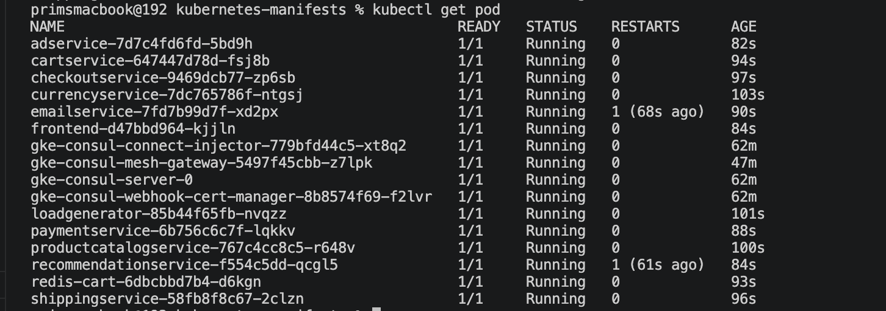

8. Access the web frontend in a browser using the frontend's external IP.

```sh
kubectl get service frontend-external | awk '{print $4}'
```

Visit `http://EXTERNAL_IP` in a web browser to access your instance of Online Boutique.

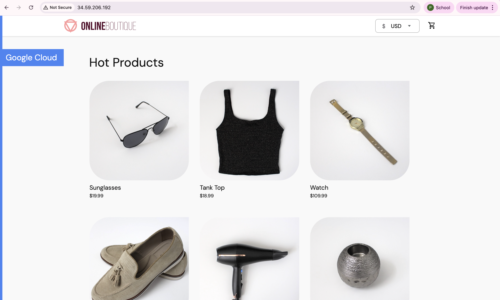

9. Connect with Consul UI by using EXTERNAL-IP of consul-ui service
```sh
kubectl get svc gke-consul-ui | awk '{print $4}'
```
Visit `https://EXTERNAL_IP` in a web browser to access Consul UI.

10. Connect with EKS cluster and LKE cluster by following the same steps in EKS cluster and LKE cluster section above.

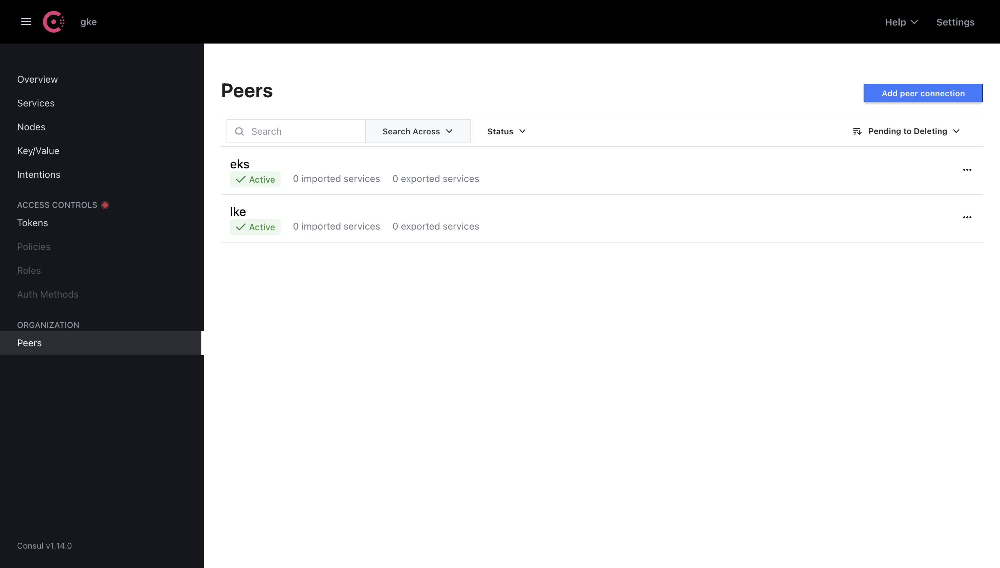

## What I change from the original code
### EKS Cluster (Terraform)
1. Node Group Instance Type: Change from t2.small to t3.small (main.tf).  
Reason: Due to free tier limit, I can't use instance type t2.small. My initial attempt to use t3.micro failed because it provided insufficient resources for the EKS control plane components, 
the AWS EBS CSI driver, and the service mesh. The Kubernetes scheduler could not place critical system pods, leading to provisioning failures. 
Finally, using t3.small provided the necessary CPU and memory overhead to successfully deploy the storage and service mesh components.

2. Desired Node Size: Reduced from 3 to 2 (main.tf).  
Reason: With my specific instance selection, a size of 3 triggered a FailedScheduling error. The scheduler reported "Too many pods," indicating that I had exceeded the pod ENI (Elastic Network Interface) limit for the instances. 
Reducing the count to 2 stabilized the cluster within the available IP and resource limits.

3. Kubernetes Version: Updated to 1.30 (variables.tf).  
Reason: Aligned the cluster version with current AWS stable support and compatibility requirements for the modern service mesh versions used in this project.

4. Service Scaling for Capacity: Scaled down non-essential services.  
Reason: I need to remove some service because of node capacity limits. I manually scaled down recommendationservice, adservice and emailservice to ensure rediscart service could run, I use the following command:
```sh
kubectl scale deployment adservice --replicas=0
kubectl scale deployment recommendationservice --replicas=0
kubectl scale deployment emailservice --replicas=0
```

### GKE Autopilot Cluster (Kubernetes Manifests)
1. Resource and Affinity Configuration:  
Reason: GKE Autopilot enforces a strict rule: if a workload uses Pod Anti-Affinity, each Pod must request at least 500m CPU. 
To operate within a smaller resource footprint and save costs, I disabled the Anti-Affinity rules (affinity: null) and explicitly set requests to 100m CPU and 200Mi Memory.


2. CRD Ownership Management (Gateway API):   
Reason: I encountered an installation conflict where the Gateway API CRDs (e.g., gatewayclasses) already existed in the cluster but lacked Helm metadata. Helm refuses to overwrite "unmanaged" resources to prevent breaking shared components.

   Solution: I used a shell loop to manually patch the CRDs with the required Helm labels and annotations, allowing the consul release to adopt and manage these existing resources.
```sh
kubectl label crd gatewayclasses.gateway.networking.k8s.io app.kubernetes.io/managed-by=Helm --overwrite
kubectl annotate crd gatewayclasses.gateway.networking.k8s.io meta.helm.sh/release-name=gke --overwrite
kubectl annotate crd gatewayclasses.gateway.networking.k8s.io meta.helm.sh/release-namespace=default --overwrite

# If there are multiple CRDs related to gateway.networking.k8s.io, you can use a loop to patch all of them at once:
for crd in $(kubectl get crd | grep "gateway.networking.k8s.io" | awk '{print $1}'); do

  echo "Patching $crd..."    

  kubectl patch crd $crd -p '{"metadata":{"labels":{"app.kubernetes.io/managed-by":"Helm"},"annotations":{"meta.helm.sh/release-name":"gke","meta.helm.sh/release-namespace":"default"}}}'

done
```

3. Experimental Resource Admission Policy:  
Reason: GKE has a built-in ValidatingAdmissionPolicy that blocks "Experimental" resources. The Consul Helm chart attempted to install the GRPCRoute resource, which was rejected by Google’s security policy.

   Solution: I modified consul-values.yaml to set manageExternalCRDs: false. This prevents the Helm chart from attempting to install restricted CRDs, relying instead on the pre-existing stable Gateway API resources provided by GKE.
```yaml
connectInject:
  enabled: true
  apiGateway:
    manageExternalCRDs: false
```
### Demo project accompanying a [Consul crash course video](https://www.youtube.com/watch?v=s3I1kKKfjtQ) on YouTube

Terraform commands to execute the script

```sh
# initialise project & download providers
terraform init

# preview what will be created with apply & see if any errors
terraform plan

# exeucute with preview
terraform apply -var-file terraform.tfvars

# execute without preview
terraform apply -var-file terraform.tfvars -auto-approve

# destroy everything
terraform destroy

# show resources and components from current state
terraform state list
```

#### Get access to EKS cluster
```sh
# install and configure awscli with access creds
aws configure

# check existing clusters list
aws eks list-clusters --region eu-central-1 --output table --query 'clusters'

# check config of specific cluster - VPC config shows whether public access enabled on cluster API endpoint
aws eks describe-cluster --region eu-central-1 --name myapp-eks-cluster --query 'cluster.resourcesVpcConfig'

# create kubeconfig file for cluster in ~/.kube
aws eks update-kubeconfig --region eu-central-1 --name myapp-eks-cluster

# test configuration
kubectl get svc
```
### Optional : clean up everything
```sh
terraform destroy -var-file terraform.tfvars
```
clean up kubeconfig file
```sh
rm -rf ~/.kube/config
```
clean terraform state
```sh
rm -rf .terraform
rm -rf terraform.tfstate
rm -rf terraform.tfstate.backup
```
uninstall consul in cluster
```sh
helm uninstall cluster-name --no-hooks
```

### Credit:
- [Consul crash course video](https://www.youtube.com/watch?v=s3I1kKKfjtQ) on YouTube
- [Github repo for gke cluster](https://github.com/GoogleCloudPlatform/microservices-demo.git)
- [Gitlab repo for eks cluster](https://gitlab.com/twn-youtube/consul-crash-course)