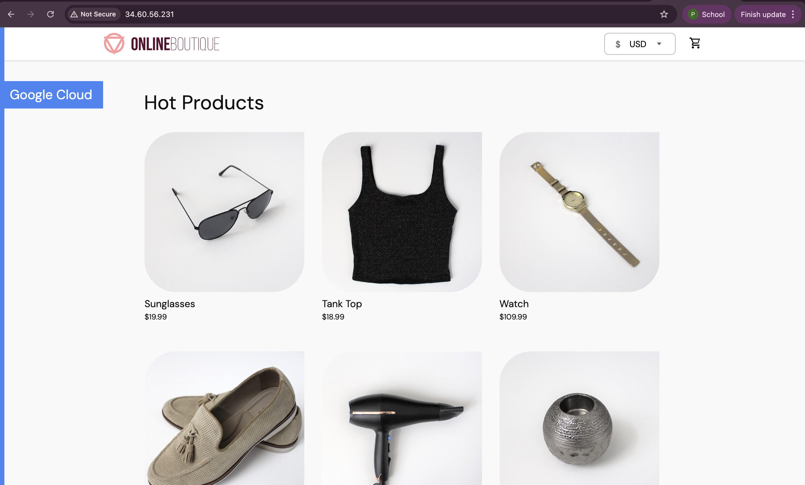

## Set up EKS cluster with terraform

prerequisite : create account AWS [https://signin.aws.amazon.com/signup?request_type=register]

### How to get access key and secret key in AWS
1. go to AWS console
IAM --> USER --> create user

2. - step 1 enter username
   - step 2 Permission option: choose attach policies directly --> select Administrator access
   - step 3 create user
   

3. Once create user successfully, go to that user
   3.1 choose security credentials tab
   3.2 create access key : 
      - step 1 choose command line interface use case
      - step 2 option (do nothing)
      - step 3 retrieve access key and secret key and save it in a safe place because you won't be able to see the secret key again after this step

   

4. copy the access key and secret key and put inside terraform.tfvars
```bash
cd terraform
cat <<EOF > terraform.tfvars
aws_access_key_id="your-access-key"
aws_secret_access_key="your-secret-key"
EOF
```

5. run terraform commands
```sh
terraform init
terraform plan
terraform apply -var-file terraform.tfvars
```

6. Update kubeconfig file for cluster in ~/.kube
```sh
aws eks update-kubeconfig --region eu-central-1 --name myapp-eks-cluster
```

7. Deploy consul
```sh
helm repo add hashicorp https://helm.releases.hashicorp.com
helm install eks hashicorp/consul --version 1.0.0 --values consul-values.yaml --set global.datacenter=eks
```

8. Check pod
```sh
kubectl get pod
```


9. Update kubeconfig file for cluster in ~/.kube
```sh
aws eks update-kubeconfig --region eu-central-1 --name myapp-eks-cluster
```

10. Deploy microservice
```sh
kubectl apply -f config-consul.yaml
```

11. Check service
```sh
kubectl get svc
```


12. Go to Consul UI by using EXTERNAL-IP of consul-ui service
```sh
https://EXTERNAL-IP
```


13. Access the web frontend in a browser using the frontend's external IP.
```sh
EXTERNAL-IP:80
```


14. Configure access rules in Consul UI about paymentservice
Go to intentions tab in Consul UI, create 3 intentions with 
   - 1 source = checkoutservice, destination = paymentservice, action = allow
   - 2 source = *, destination = paymentservice, action = deny
   - 3 source = paymentservice, destination = *, action = deny


## Set up LKE cluster
Prerequisite: create account in Linode [https://www.linode.com/]

1. create the cluster in Linode called 'lke' and download lke-consul-kubeconfig.yaml (my lke-consul-kubeconfig.yaml in kubenetes folder)
```bash
cd kubernetes
export KUBECONFIG=~/Downloads/lke-consul-kubeconfig.yaml # or your path file
```


2. Check node
```bash
kubectl get node
```

3. Set permissions
```bash
chmod 700 ~/Downloads/lke-consul-kubeconfig.yaml
```

4. Deploy consul
```bash
helm repo add hashicorp https://helm.releases.hashicorp.com
helm install lke hashicorp/consul --version 1.0.0 --values consul-values.yaml --set global.datacenter=lke
```

5. Check crd
```bash
kubectl get crd | grep consul
```

6. Deploy microservice
```bash
kubectl apply -f config-consul.yaml
```

7. Check service
```bash
kubectl get svc
```


8. Go to Consul UI by using EXTERNAL-IP of consul-ui service
```sh
https://EXTERNAL-IP
```


9. Access the web frontend in a browser using the frontend's external IP.
```sh
EXTERNAL-IP:80
```


## Connecting to EKS cluster and LKE cluster
1. In lke terminal, 
```bash
kubectl config current-context # make sure you are in lke cluster
kubectl apply -f consul-mesh-gateway.yaml
kubectl get mesh # check if mesh gateway is created
```

2. In eks terminal, 
```bash
kubectl config current-context # make sure you are in eks cluster
kubectl apply -f consul-mesh-gateway.yaml
kubectl get mesh # check if mesh gateway is created
```

3. Go to eks consul UI and choose peer tab, 
   1. add peer connection with lke cluster : generate token tab (name of peer = lke) and generate token
   2. copy token and close
   3. go to lke consul UI, choose peer tab, add peer connection with eks cluster : establish connection tab, paste the token and establish connection

#### LKE peer connection with EKS cluster

#### EKS peer connection with LKE cluster


## Configure failover with service resolver
1. Export service in lke cluster
```bash
# in lke terminal
kubectl apply -f exported-service.yaml
```
2. Go to lke consul UI, check peer tap, click exported service. make sure you see shippingservice


3. Go to eks consul UI, check service tab, see shippingservice


4. Apply service resolver in eks cluster
```bash
# in eks terminal
kubectl apply -f service-resolver.yaml
```
5. Try to delete shippingservice in eks cluster
```bash
kubectl delete deployment shippingservice
```
6. Go to web frontend, try to add some items to the cart, see if shippingservice is still working or not.


## Set up GKE cluster
1. Ensure you have the following requirements:
   - [Google Cloud project](https://cloud.google.com/resource-manager/docs/creating-managing-projects#creating_a_project).
   - Shell environment with `gcloud`, `git`, and `kubectl`.
   - When create project, make sure to enable billing and set up a billing account. You can follow [this guide](https://cloud.google.com/billing/docs/how-to/manage-billing-account) to set up a billing account and link it to your project.
   - Make sure you enable kubenetes API in your project. You can do this by going to the [Google Cloud Console](https://console.cloud.google.com/apis/library/container.googleapis.com) and enabling the Kubernetes Engine API for your project.

2. Clone the latest major version.

   ```sh
   git clone --depth 1 --branch v0 https://github.com/GoogleCloudPlatform/microservices-demo.git
   cd microservices-demo/
   ```

   The `--depth 1` argument skips downloading git history.

3. Set the Google Cloud project and region and ensure the Google Kubernetes Engine API is enabled.

   ```sh
   export PROJECT_ID=<PROJECT_ID>
   export REGION=us-central1
   gcloud services enable container.googleapis.com \
     --project=${PROJECT_ID}
   ```

   Substitute `<PROJECT_ID>` with the ID of your Google Cloud project.

4. Create a GKE cluster and get the credentials for it.

   ```sh
   gcloud container clusters create-auto online-boutique \
     --project=${PROJECT_ID} --region=${REGION}
   ```

   Creating the cluster may take a few minutes.

5. Deploy Online Boutique to the cluster.

   ```sh
   kubectl apply -f ./release/kubernetes-manifests.yaml
   ```

6. Wait for the pods to be ready.

   ```sh
   kubectl get pods
   ```

   After a few minutes, you should see the Pods in a `Running` state:

   ```
   NAME                                     READY   STATUS    RESTARTS   AGE
   adservice-76bdd69666-ckc5j               1/1     Running   0          2m58s
   cartservice-66d497c6b7-dp5jr             1/1     Running   0          2m59s
   checkoutservice-666c784bd6-4jd22         1/1     Running   0          3m1s
   currencyservice-5d5d496984-4jmd7         1/1     Running   0          2m59s
   emailservice-667457d9d6-75jcq            1/1     Running   0          3m2s
   frontend-6b8d69b9fb-wjqdg                1/1     Running   0          3m1s
   loadgenerator-665b5cd444-gwqdq           1/1     Running   0          3m
   paymentservice-68596d6dd6-bf6bv          1/1     Running   0          3m
   productcatalogservice-557d474574-888kr   1/1     Running   0          3m
   recommendationservice-69c56b74d4-7z8r5   1/1     Running   0          3m1s
   redis-cart-5f59546cdd-5jnqf              1/1     Running   0          2m58s
   shippingservice-6ccc89f8fd-v686r         1/1     Running   0          2m58s
   ```

7. Access the web frontend in a browser using the frontend's external IP.

   ```sh
   kubectl get service frontend-external | awk '{print $4}'
   ```

   Visit `http://EXTERNAL_IP` in a web browser to access your instance of Online Boutique.



## How to deploy Online Boutique with Helm
1. go to kubernetes-manifests
```bash
cd kubernetes-manifests
helm repo add hashicorp https://helm.releases.hashicorp.com
helm install gke hashicorp/consul --values consul-values.yaml # if you already have consul installed, use `helm upgrade gke hashicorp/consul --values consul-values.yaml`
```

### What I change from the original code
1. node group instance type to t3.small (main.tf)
Reason: Due to free tier limit, I can't use instance type t2.small. Then, I initially used t3.micro instance type for the node group. 
However, this instance type does not provide sufficient resources to run all the necessary components of the EKS cluster, including the AWS EBS CSI driver and service mesh components. 
As a result, the Kubernetes scheduler was unable to place critical system pods, leading to provisioning failures. Upgrading the node instances to t3.medium provided more CPU and memory resources, allowing the scheduler to successfully place all required pods and enabling successful provisioning of storage and service mesh components.

2. change desire size to 2 (main.tf)
Reason: The original code has a desired size of 3. But I got the error " Warning  FailedScheduling  4m11s  default-scheduler  0/3 nodes are available: 3 Too many pods. preemption: 0/3 nodes are available: 3 No preemption victims found for incoming pod."

3. Change kubernetes version to 1.30 (variables.tf)
variable k8s_version {
    default = "1.30"
}

4. I need to remove some service because of node capacity limits. I remove recommendationservice, adservice and emailservice to make rediscart service run, I use the following command:
```sh
kubectl scale deployment adservice --replicas=0
kubectl scale deployment recommendationservice --replicas=0
kubectl scale deployment emailservice --replicas=0
```
### Demo project accompanying a [Consul crash course video](https://www.youtube.com/watch?v=s3I1kKKfjtQ) on YouTube

Terraform commands to execute the script

```sh
# initialise project & download providers
terraform init

# preview what will be created with apply & see if any errors
terraform plan

# exeucute with preview
terraform apply -var-file terraform.tfvars

# execute without preview
terraform apply -var-file terraform.tfvars -auto-approve

# destroy everything
terraform destroy

# show resources and components from current state
terraform state list
```

#### Get access to EKS cluster
```sh
# install and configure awscli with access creds
aws configure

# check existing clusters list
aws eks list-clusters --region eu-central-1 --output table --query 'clusters'

# check config of specific cluster - VPC config shows whether public access enabled on cluster API endpoint
aws eks describe-cluster --region eu-central-1 --name myapp-eks-cluster --query 'cluster.resourcesVpcConfig'

# create kubeconfig file for cluster in ~/.kube
aws eks update-kubeconfig --region eu-central-1 --name myapp-eks-cluster

# test configuration
kubectl get svc
```
### Optional : clean up everything
```sh
terraform destroy -var-file terraform.tfvars
```
clean up kubeconfig file
```sh
rm -rf ~/.kube/config
```
clean terraform state
```sh
rm -rf .terraform
rm -rf terraform.tfstate
rm -rf terraform.tfstate.backup
```

credit:
- [Consul crash course video](https://www.youtube.com/watch?v=s3I1kKKfjtQ) on YouTube
- [github repo for gke cluster](https://github.com/GoogleCloudPlatform/microservices-demo.git)
- [gitlab repo for eks cluster](https://gitlab.com/twn-youtube/consul-crash-course)